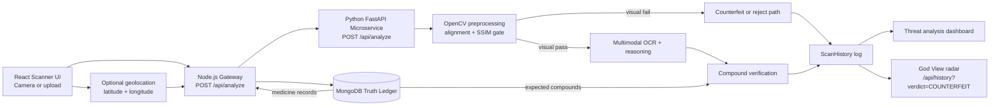

# OptiPharma

<div align="center">

### Counterfeit medicine detection with hybrid computer vision, multimodal AI, and a live geospatial threat radar

[](./frontend)
[](./frontend)
[](./backend)
[](./backend)
[](./microservice)
[](./frontend/src/components/ThreatMap.jsx)

</div>

OptiPharma is a hackathon-built counterfeit medicine detection platform designed for fast, explainable verification in the field. It combines a scanner-grade frontend, a Node.js gateway, a MongoDB Truth Ledger, and a Python AI/CV microservice to determine whether a scanned medicine strip is authentic, suspicious, or inconclusive.

This is not just OCR on top of an image upload. OptiPharma uses a layered verification pipeline:

- a deterministic visual gate for fast rejection of obvious mismatches
- multimodal AI extraction for real-world foil packaging and messy text
- database-grounded compound verification against official medicine records
- real-time scan logging and a geospatial "God View" threat radar for counterfeit hotspots

## Why It Stands Out

| Capability | What it does | Why it matters |
| --- | --- | --- |
| Visual gate | Uses OpenCV and SSIM before AI reasoning | Reduces cost, latency, and false confidence on obvious fakes |
| Truth Ledger | Verifies against MongoDB-backed medicine records | Prevents unconstrained model guessing |
| AI extraction | Reads real pack text from full-strip images | More robust than brittle text-region crops |
| God View radar | Plots counterfeit scans on a live map | Turns scan events into operational threat intelligence |
| Graceful fallback | Keeps the demo alive during unstable external conditions | Better for hackathon reliability and live judging |

## Product Snapshot

### Core user journey

1. An operator captures or uploads a medicine strip in the React scanner.
2. The browser optionally attaches geolocation coordinates if permission is granted.
3. The Node.js gateway forwards the image to the Python verification service.
4. The backend checks the Truth Ledger and saves the scan in `ScanHistory`.
5. The UI returns a threat analysis report and the God View radar updates with new counterfeit intercepts.

### Final verdicts

- `VERIFIED`
- `COUNTERFEIT`
- `INCONCLUSIVE`

## The God View

The newest OptiPharma capability is the God View: a live, dark-mode geospatial radar for counterfeit activity.

- pulls from `GET /api/history?verdict=COUNTERFEIT`
- filters only scans with valid `latitude` and `longitude`
- renders pulsing red intercept markers on a Leaflet map
- shows `brandName`, `batchNumber`, and scan time in each popup
- updates the narrative from "single scan analysis" to "network-wide threat visibility"

This turns OptiPharma from a verification demo into a lightweight command-center concept for pharma supply chain monitoring.

## Architecture



## What Happens In One Scan

### 1. Image acquisition

The frontend supports:

- live webcam capture with a scanner-style UI
- image upload fallback for stored inspection photos
- optional browser geolocation with a 5-second timeout

If the user denies location permissions, the scan still proceeds normally. The only difference is that the event will not appear on the geospatial map.

### 2. Gateway orchestration

The Express gateway:

- receives `multipart/form-data`
- validates the image
- normalizes optional `latitude` and `longitude`
- queries MongoDB for the matching medicine record
- forwards the scan to the Python service
- logs the final result in `ScanHistory`

### 3. Deterministic CV gate

The Python microservice performs early visual checks such as:

- preprocessing
- contour and alignment support
- SSIM-based similarity checks

This acts as a fast, deterministic filter before the heavier multimodal stage.

### 4. Multimodal verification

If the image passes the visual gate, the microservice sends the full strip image through the AI reasoning path to extract:

- brand context
- batch data
- raw OCR text
- compounds or medicine cues from packaging

### 5. Database-grounded decision

The extracted evidence is compared against MongoDB Truth Ledger data such as:

- brand name
- batch number
- expected compounds
- manufacturer metadata

### 6. Threat intelligence output

The final report and scan history record power:

- the frontend threat dashboard
- historical query endpoints
- the God View radar for counterfeit intercept clustering

## Tech Stack

| Layer | Stack | Responsibility |
| --- | --- | --- |
| Frontend | React 18, Vite, Tailwind CSS, Framer Motion, React Webcam | Scanner UX, dashboard, result rendering |
| Map layer | React Leaflet, Leaflet | Live counterfeit geospatial radar |
| Gateway | Node.js, Express, Multer, Axios | Request orchestration, logging, history APIs |
| Database | MongoDB, Mongoose | Truth Ledger and scan history persistence |
| AI/CV microservice | FastAPI, OpenCV, scikit-image, Pillow, NumPy | CV gate, analysis pipeline, response shaping |
| Multimodal reasoning | Gemini-powered integration | OCR and semantic verification path |

## Repository Layout

```text
OptiPharma/
|-- backend/
|   |-- models/
|   |-- seed.js
|   `-- server.js
|-- frontend/
|   |-- src/components/
|   |   |-- Scanner.jsx
|   |   |-- ThreatDashboard.jsx
|   |   `-- ThreatMap.jsx
|   `-- vite.config.js
|-- microservice/
|   |-- main.py
|   |-- cv_pipeline.py
|   `-- requirements.txt
`-- README.md
```

## Quick Start

### Prerequisites

- Node.js 18+
- Python 3.10+
- MongoDB local instance or Atlas
- A valid Gemini API key

### 1. Clone the repository

```bash
git clone <your-repo-url>
cd OptiPharma
```

### 2. Start the Python AI/CV microservice

```bash
cd microservice
python -m venv .venv
```

Activate the environment:

```bash
# Windows PowerShell
.\.venv\Scripts\Activate.ps1

# macOS / Linux
source .venv/bin/activate
```

Install dependencies:

```bash
pip install -r requirements.txt
```

Create `microservice/.env`:

```env
GEMINI_API_KEY=your_gemini_api_key
```

Run the service:

```bash
python -m uvicorn main:app --host 0.0.0.0 --port 8000 --reload
```

Health check:

```bash
curl http://localhost:8000/health
```

### 3. Start the Node.js gateway

Open a second terminal:

```bash
cd backend
npm install
```

Create `backend/.env`:

```env
PORT=5000
MONGO_URI=mongodb://localhost:27017/optipharma
PYTHON_SERVICE_URL=http://localhost:8000
```

Seed the Truth Ledger:

```bash
npm run seed
```

Start the gateway:

```bash
npm run dev
```

Health check:

```bash
curl http://localhost:5000/health
```

### 4. Start the frontend

Open a third terminal:

```bash
cd frontend
npm install
npm run dev
```

Open:

```text
http://localhost:5173
```

The frontend is configured to proxy `/api` requests to `http://localhost:5000` through Vite.

## Recommended Startup Order

1. MongoDB
2. Python microservice on `:8000`
3. Node.js gateway on `:5000`
4. React frontend on `:5173`

## Environment Variables

| Service | Variable | Required | Default | Description |
| --- | --- | --- | --- | --- |
| `microservice` | `GEMINI_API_KEY` | Yes | None | Auth for the multimodal AI path |
| `backend` | `PORT` | No | `5000` | Express gateway port |
| `backend` | `MONGO_URI` | Yes | `mongodb://localhost:27017/optipharma` | MongoDB connection string |
| `backend` | `PYTHON_SERVICE_URL` | No | `http://localhost:8000` | Base URL for the FastAPI service |

## Key API Surfaces

### Gateway endpoints

| Method | Endpoint | Purpose |
| --- | --- | --- |
| `POST` | `/api/analyze` | Primary scan endpoint used by the frontend |
| `POST` | `/api/scan` | Alias for scan ingestion |
| `GET` | `/api/history` | Returns recent scan history |
| `GET` | `/api/medicines` | Returns active Truth Ledger medicines |
| `GET` | `/api/brands` | Returns distinct brand names |
| `GET` | `/health` | Service health check |

### Microservice endpoints

| Method | Endpoint | Purpose |
| --- | --- | --- |
| `POST` | `/api/analyze` | Hybrid CV + AI analysis |
| `GET` | `/health` | Microservice health check |

## Request And Logging Model

### Frontend scan payload

The scanner sends `multipart/form-data` to `POST /api/analyze` with:

- `image`
- optional `latitude`
- optional `longitude`

### `ScanHistory` stores

- `batchNumber`
- `brandName`
- `verdict`
- `ssimScore`
- `confidence`
- `extractedText`
- `compoundMatch`
- `compoundMatchPercentage`
- `rejectionReason`
- `processingTimeMs`
- `latitude`
- `longitude`
- `ipAddress`
- `scannedAt`

## Demo Flow For Judges

1. Open the scanner and capture a medicine strip.
2. Run analysis and show the verdict dashboard.
3. Highlight extracted brand, batch, SSIM evidence, and compound verification.
4. Open the God View section and point to counterfeit intercept markers.
5. Explain that each radar point is a persisted scan event, not just frontend mock data.

## Seeded Demo Medicines

The included seed data gives you a usable starting Truth Ledger for demos and local testing. The current dataset includes medicines such as:

- PAN 40
- Dolo 650
- Augmentin 625 Duo
- Allegra 120
- Glycomet-GP 1
- OptiCillin

Seed command:

```bash
cd backend
npm run seed
```

## Troubleshooting

### Port `8000` already in use

If the Python microservice fails with a socket bind error on Windows, something else is already listening on port `8000`.

You can either:

- stop the existing process using Task Manager or `taskkill /PID <pid> /F`
- run the microservice on another port, such as `8001`, and update `PYTHON_SERVICE_URL` in `backend/.env`

Example:

```bash
python -m uvicorn main:app --host 0.0.0.0 --port 8001 --reload
```

```env
PYTHON_SERVICE_URL=http://localhost:8001
```

### Geolocation denied

This is expected behavior, not a bug. The scan still completes, but that scan will not be plotted on the God View map.

### Frontend `npm` blocked in PowerShell

If PowerShell blocks `npm.ps1`, use:

```bash
npm.cmd install
npm.cmd run dev
```

### No medicines appearing in verification

Re-run the seed step:

```bash
cd backend
npm run seed
```

## Why This Matters

Counterfeit pharmaceuticals are not just a supply-chain inconvenience. They are a direct patient safety threat. OptiPharma frames the problem the right way:

- verify physical packaging evidence
- ground decisions in official data
- keep an audit trail
- surface geographic threat patterns in real time

That combination makes the project compelling both as a hackathon demo and as a blueprint for a more operational anti-counterfeit platform.

## Roadmap

- batch-level signatures and manufacturer-side verification
- offline-first field capture mode
- richer hotspot analytics and clustering
- barcode and QR validation
- alerting workflows for repeated counterfeit intercepts
- role-based dashboard views for regulators, distributors, and inspectors

## Built For

OptiPharma was built for the IIT-BHU Codecure Hackathon in the Techno-Pharma track.

If you are reviewing this project quickly, the simplest summary is:

> OptiPharma turns a medicine strip scan into a structured authenticity verdict, a persisted forensic record, and a live counterfeit threat signal on a map.
