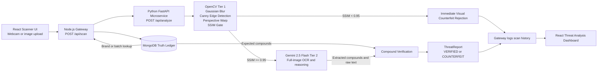

# OptiPharma

[](./frontend)
[](./frontend)
[](./backend)
[](./backend)
[](./microservice)
[](./microservice)

OptiPharma is a counterfeit medicine detection platform built for the IIT-BHU Codecure Hackathon, Techno-Pharma track. It combines deterministic computer vision, multimodal LLM reasoning, and a secure pharmaceutical Truth Ledger to verify whether a physical medicine strip matches its official formulation.

This is not a basic OCR wrapper. OptiPharma is a multi-stage authenticity pipeline that cross-checks visual structure, extracted foil text, and expected active ingredients before returning a verdict to a live threat analysis dashboard.

## Elevator Pitch

Counterfeit pharmaceuticals are not just a supply-chain problem; they are a patient safety problem. OptiPharma addresses that risk with a pragmatic, production-minded architecture:

- A scanner-first React frontend captures a medicine strip from a live webcam or uploaded image.
- A Node.js gateway enriches the request with official compound data from MongoDB.
- A Python AI microservice runs a deterministic OpenCV gate before escalating to multimodal LLM reasoning.
- The final decision is returned as a structured Threat Analysis Report: `VERIFIED`, `COUNTERFEIT`, or `INCONCLUSIVE`.

The result is a system that is fast on obvious failures, intelligent on hard cases, and resilient enough for live demo conditions.

## Why This Architecture Matters

Most hackathon demos jump directly from image upload to LLM OCR. OptiPharma does not. It uses a three-tier product architecture with a deterministic rejection gate in front of the multimodal model:

1. `Capture + UX Layer`
   React, Tailwind CSS, and Framer Motion power a scanner-grade interface optimized for live camera capture and operator review.
2. `Gateway + Truth Ledger Layer`
   Node.js, Express, and MongoDB resolve the expected active ingredients for a specific brand or batch before AI inference begins.
3. `AI Verification Layer`
   Python, FastAPI, OpenCV, and Gemini handle visual anomaly detection, text extraction, and compound verification.

This separation keeps the system modular, auditable, and scalable.

## Tech Stack

| Layer | Stack | Responsibility |
| --- | --- | --- |
| Frontend | React, Vite, Tailwind CSS, Framer Motion | Clinical scanner UI, webcam capture, live threat dashboard |
| Gateway | Node.js, Express, Multer, Axios | Request orchestration, MongoDB lookup, scan forwarding, result logging |
| Database | MongoDB, Mongoose | Truth Ledger for official medicines and scan history |
| AI/CV Microservice | Python, FastAPI, OpenCV, scikit-image, Pillow | SSIM gate, image preprocessing, multimodal verification pipeline |
| Multimodal Model | Google Gemini API | Gemini 2.5 Flash-class full-frame text extraction and semantic compound verification |

> Note  
> The repository is wired against the Google Gemini API through `microservice/gemini_client.py`. For the hackathon narrative and deployment target, the multimodal OCR path is positioned around Gemini 2.5 Flash-class reasoning. If you want to change the configured model name locally, update `MODEL_NAME` in [`microservice/gemini_client.py`](./microservice/gemini_client.py).

## Architecture and Data Flow



## End-to-End Verification Flow

### 1. Capture

The React frontend captures a live webcam image of a medicine strip or accepts an uploaded image. The operator also provides a brand name and, optionally, a batch number.

### 2. Database Lookup

The Node gateway queries MongoDB, the OptiPharma Truth Ledger, to retrieve the expected active ingredients and reference logo for that medicine. This creates an official verification baseline before any LLM reasoning occurs.

### 3. Tier 1: The Deterministic Gate

The Python microservice runs a classical computer vision pipeline:

- Gaussian blur for noise control
- Canny edge detection for contour isolation
- Perspective warp for strip alignment
- SSIM comparison against a verified logo/layout reference

If SSIM falls below `0.95`, the sample is instantly rejected as a visual counterfeit without spending LLM tokens.

### 4. Tier 2: The Deep Reasoner

If the sample passes the OpenCV gate, the pipeline sends the full uncropped high-resolution image to the Gemini 2.5 Flash multimodal stage. This is deliberate: instead of relying on brittle text-region cropping, OptiPharma lets the model find and read the chemical text directly from the real foil surface.

### 5. Compound Verification

The compounds extracted from the strip are compared against the expected compounds from MongoDB. The system then computes a match percentage and determines whether the physical strip aligns with the official pharmaceutical record.

### 6. Response

The frontend dashboard renders a structured Threat Analysis Report with:

- final verdict
- confidence score
- SSIM evidence
- extracted text
- compound verification result
- processing time

## Standout Features and Technical Flexes

### Hybrid Efficiency

OptiPharma does not waste expensive LLM calls on obvious counterfeits. The OpenCV SSIM gate acts as a first-pass rejector, which reduces API cost, lowers latency, and gives the system a clear deterministic layer before probabilistic reasoning.

### Multimodal Robustness

Instead of depending on fragile OpenCV text cropping, the pipeline now sends the full high-resolution strip image to the multimodal model. This is a stronger approach for messy, real-world foil backgrounds, lighting reflections, and partial text visibility.

### Truth Ledger Verification

The system does not ask the LLM to hallucinate what a drug should contain. The source of truth lives in MongoDB. Gemini extracts evidence from the physical strip; MongoDB defines the official expected composition.

### Hackathon Safety Net

The Python microservice includes explicit fallback handling for rate limits, transient API failures, or unreliable Wi-Fi during a live presentation. Instead of crashing the demo, the pipeline degrades gracefully and keeps the presentation flow intact.

### Auditability and Traceability

Every scan can be logged into `ScanHistory`, including verdict, SSIM score, compound match percentage, extracted text, rejection reason, and processing time. This turns a demo into something much closer to an operational compliance tool.

## Repository Structure

```text
OptiPharma/
|-- frontend/        # React scanner UI and threat dashboard
|-- backend/         # Node.js gateway, MongoDB models, seed data
|-- microservice/    # FastAPI + OpenCV + Gemini verification pipeline
`-- README.md
```

## Local Setup

### Prerequisites

Install the following before starting:

- Node.js 18+
- Python 3.10+
- MongoDB Community Edition or MongoDB Atlas
- A Google Gemini API key

### 1. Clone the Repository

```bash
git clone <your-repo-url>
cd OptiPharma
```

### 2. Configure the Python AI/CV Microservice

Create the environment file:

```bash
cd microservice
```

Create `microservice/.env`:

```env
GEMINI_API_KEY=your_google_gemini_api_key
```

Create a virtual environment and install dependencies:

```bash
python -m venv .venv
```

Activate it:

```bash
# Windows PowerShell
.venv\Scripts\Activate.ps1

# macOS / Linux
source .venv/bin/activate
```

Install packages:

```bash
pip install -r requirements.txt
```

Run the FastAPI microservice on port `8000`:

```bash
uvicorn main:app --reload --port 8000
```

Health check:

```bash
curl http://localhost:8000/health
```

### 3. Configure the Node.js Gateway and MongoDB Truth Ledger

Open a new terminal:

```bash
cd backend
npm install
```

Create `backend/.env`:

```env
PORT=5000
MONGO_URI=mongodb://localhost:27017/optipharma
PYTHON_SERVICE_URL=http://localhost:8000
```

Seed the Truth Ledger:

```bash
npm run seed
```

Start the gateway:

```bash
npm run dev
```

Health check:

```bash
curl http://localhost:5000/health
```

### 4. Configure the React Frontend

Open a third terminal:

```bash
cd frontend
npm install
npm run dev
```

The Vite dev server runs on:

```text
http://localhost:5173
```

The frontend is already configured to proxy `/api` requests to the Node gateway on `http://localhost:5000`.

## Recommended Startup Order

Start the system in this order:

1. MongoDB
2. Python microservice on `:8000`
3. Node.js gateway on `:5000`
4. React frontend on `:5173`

## Environment Variables

| Service | Variable | Required | Default | Purpose |
| --- | --- | --- | --- | --- |
| `microservice` | `GEMINI_API_KEY` | Yes | None | Authenticates Gemini multimodal API calls |
| `backend` | `PORT` | No | `5000` | Express gateway port |
| `backend` | `MONGO_URI` | Yes | `mongodb://localhost:27017/optipharma` | MongoDB connection string |
| `backend` | `PYTHON_SERVICE_URL` | No | `http://localhost:8000` | FastAPI microservice base URL |

## Core API Surfaces

### Frontend to Gateway

- `POST /api/scan`
  Accepts the uploaded image plus brand and optional batch metadata.

### Gateway to Frontend

- `GET /api/history`
  Returns the latest scan history for analytics and operator review.
- `GET /api/medicines`
  Returns active Truth Ledger medicine entries.
- `GET /health`
  Operational status for the gateway.

### Gateway to Microservice

- `POST /api/analyze`
  Sends the image, expected compounds, brand context, batch number, and reference logo to the AI/CV pipeline.

### Microservice Health

- `GET /health`
  Operational status for the AI/CV service.

## Truth Ledger Design

The MongoDB `Medicine` collection stores:

- batch number
- brand name
- manufacturer
- expected compounds
- expiry date
- reference logo filename
- product category

The MongoDB `ScanHistory` collection stores:

- verdict
- SSIM score
- extracted text
- compound match percentage
- rejection reason
- processing time
- timestamp

This enables both verification and traceable operational analytics.

## Demo Data Included

The seed file includes multiple representative medicines, including:

- PAN 40
- Dolo 650
- Augmentin 625 Duo
- Allegra 120
- Glycomet-GP 1
- OptiCillin

These are inserted into the MongoDB Truth Ledger through:

```bash
cd backend
npm run seed
```

## Why Judges Should Care

OptiPharma demonstrates the kind of architecture that can move beyond a hackathon:

- deterministic CV for cost-efficient screening
- multimodal reasoning for messy real-world packaging
- database-grounded verification instead of unconstrained LLM output
- typed service contracts across all layers
- graceful degradation under live-demo failure conditions

This is not a single-model demo. It is a system design for pharmaceutical authenticity verification.

## Future Roadmap

- batch-specific ledger verification with manufacturer-side signing
- offline-first capture workflows for field inspections
- analytics dashboard for counterfeit hotspot detection
- barcode and QR cross-validation
- confidence calibration with larger reference datasets

## Team

Built for IIT-BHU Codecure Hackathon, Techno-Pharma track.

If you are reviewing this project as a judge, the core takeaway is simple: OptiPharma turns a phone or laptop camera into a multi-stage pharmaceutical verification workflow grounded in computer vision, multimodal AI, and a verifiable database of truth.
